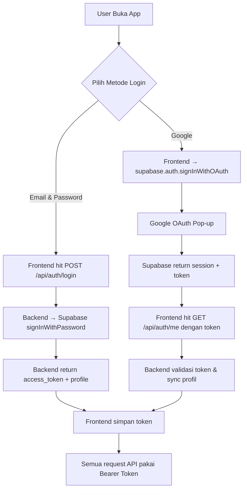

# 🔐 Panduan Koneksi Frontend ke Backend Auth API

Dokumen ini menjelaskan cara tim **Frontend** menyambungkan diri ke **Backend Auth API** FinPredict.  
Backend menyediakan dua metode autentikasi: **Manual** (Email & Password) dan **Google Login**.

---

## Daftar Endpoint Auth

| Method | Endpoint | Auth | Fungsi |
| :---: | :--- | :---: | :--- |
| `POST` | `/api/auth/register` | 🌐 Public | Daftar akun baru (email + password) |
| `POST` | `/api/auth/login` | 🌐 Public | Login (email + password), mendapat token |
| `GET` | `/api/auth/me` | 🔒 Bearer | Ambil profil user (auto-sync untuk Google Login) |
| `PUT` | `/api/auth/profile` | 🔒 Bearer | Update profil (full_name, avatar_url) |

> [!TIP]
> Dokumentasi interaktif lengkap tersedia di **Swagger UI**: `http://localhost:5000/api-docs`

---

## Flow 1: Manual Login (Email & Password)

Ini adalah flow tradisional. Frontend cukup mengirim data ke API backend, mendapatkan token, lalu menyimpannya.

### Langkah 1 — Register
```
POST /api/auth/register
Content-Type: application/json

{
  "email": "user@example.com",
  "password": "password123",
  "full_name": "John Doe"
}
```

**Response (201):**
```json
{
  "status": "success",
  "message": "Registration successful.",
  "data": {
    "user": {
      "id": "uuid-dari-supabase",
      "full_name": "John Doe",
      "avatar_url": null,
      "created_at": "...",
      "updated_at": "..."
    },
    "access_token": "eyJhbGci...",
    "refresh_token": "v1.MR..."
  }
}
```

### Langkah 2 — Login
```
POST /api/auth/login
Content-Type: application/json

{
  "email": "user@example.com",
  "password": "password123"
}
```

**Response (200):**
```json
{
  "status": "success",
  "message": "Login successful.",
  "data": {
    "user": { ... },
    "access_token": "eyJhbGci...",
    "refresh_token": "v1.MR..."
  }
}
```

### Langkah 3 — Simpan Token & Gunakan
Setelah mendapatkan `access_token`, simpan di `localStorage` atau state management, lalu sertakan di setiap request API berikutnya:

```
GET /api/auth/me
Authorization: Bearer eyJhbGci...
```

---

## Flow 2: Google Login

Google Login memerlukan interaksi browser (pop-up/redirect), jadi prosesnya **dimulai di Frontend** menggunakan Supabase SDK.

### Langkah 1 — Install Supabase di Frontend
```bash
npm install @supabase/supabase-js
```

### Langkah 2 — Buat Supabase Client di Frontend
```typescript
// src/lib/supabaseClient.ts
import { createClient } from '@supabase/supabase-js';

const supabaseUrl = import.meta.env.VITE_SUPABASE_URL;
const supabaseAnonKey = import.meta.env.VITE_SUPABASE_ANON_KEY;

export const supabase = createClient(supabaseUrl, supabaseAnonKey);
```

**Tambahkan `.env` di folder frontend:**
```env
VITE_SUPABASE_URL=https://uzzypvixmneaykmzvhog.supabase.co
VITE_SUPABASE_ANON_KEY=sb_publishable_ynwMSZ4OPly9zZEh5Wnbhw_3y6EKqRT
```

### Langkah 3 — Trigger Login Google
```typescript
import { supabase } from '../lib/supabaseClient';

const handleGoogleLogin = async () => {
  const { error } = await supabase.auth.signInWithOAuth({
    provider: 'google',
    options: {
      redirectTo: window.location.origin, // kembali ke app setelah login
    },
  });

  if (error) console.error('Login error:', error.message);
};
```

### Langkah 4 — Ambil Token & Sync ke Backend
Setelah user berhasil login Google dan di-redirect kembali ke frontend:
```typescript
import { supabase } from '../lib/supabaseClient';
import api from '../lib/axios'; // Axios instance kita

// Listener: otomatis jalan saat login berhasil
supabase.auth.onAuthStateChange(async (event, session) => {
  if (event === 'SIGNED_IN' && session) {
    const token = session.access_token;

    // Sync profil ke backend kita
    const response = await api.get('/auth/me', {
      headers: { Authorization: `Bearer ${token}` }
    });

    console.log('Profil user:', response.data);
  }
});
```

---

## Setup Axios Interceptor (Rekomendasi)

Agar tidak perlu menulis `Authorization: Bearer ...` berulang-ulang di setiap API call, buat **Axios instance** dengan interceptor otomatis:

```typescript
// src/lib/axios.ts
import axios from 'axios';
import { supabase } from './supabaseClient';

const api = axios.create({
  baseURL: import.meta.env.VITE_API_URL || 'http://localhost:5000/api',
  headers: { 'Content-Type': 'application/json' },
});

// Interceptor: otomatis suntik token ke setiap request
api.interceptors.request.use(async (config) => {
  const { data: { session } } = await supabase.auth.getSession();
  const token = session?.access_token;

  if (token) {
    config.headers['Authorization'] = `Bearer ${token}`;
  }
  return config;
});

export default api;
```

### Contoh Penggunaan di Komponen React
Setelah Axios interceptor terpasang, pemanggilan API jadi **sangat sederhana**:

```typescript
import api from '../lib/axios';

// ✅ Token otomatis disertakan oleh interceptor!
const profile = await api.get('/auth/me');
const updated = await api.put('/auth/profile', { full_name: 'Nama Baru' });
```

---

## Ringkasan Diagram Alur


